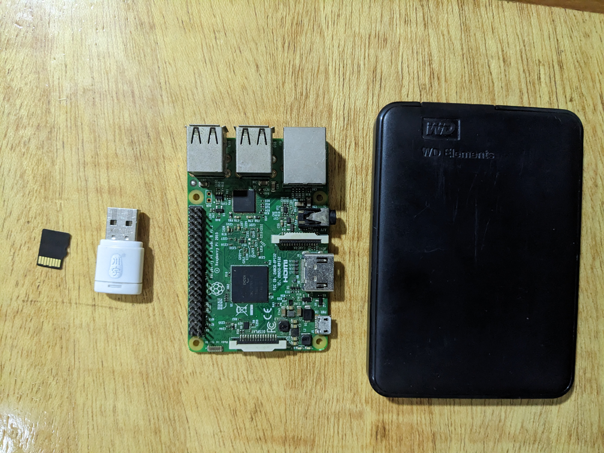

# Personal Hosted Home Server 

## Intro
This repository is the documentation for setting up a personal hosted home server. This self hosted home server will be built using a raspberrypi 

## Why a home server? 
Someone might ask why do you need a home server? Im creating this homeserver to hep me to manage some of my personal data which includes , music , videos and movies rather relying on cloud services to store these data . One of the main important points is also to store data when im developing.

### What services will the server provide 
This server will provide the services below (will be updating it as i move forward):
- NAS(Network Access Storage)
  Will need this service to be able to access all data I host on it whenever I connect any device to my local network

- Media Server
  Will need media server to host all my movies and videos on it.

- Ad Blocker
  This service will be used to do a network wide blocking of all ads on my network. No more annoying ads in case a TV is connected to the network to watch videos or youtube LOL

- File Manager 
  Will need a file manager to easily manage all files on it 

- Programming languages and dependencies
  Will be installing programming languages and dependencies that i can code on it when im connected on it and run scripts. Thinking of getting PHP and Node on it for the mean time . Since I mostly code in JS and PHP . Will install Python for some scripting 

- Blockchain explorer 
  Need a blockchain explorer , preferably a Bitcoin explorer so that I can explorer the blockchain. Dont know if i can do that without setting up a Bitcoin Node, which im not willing to do . We will see if it is possible

## Stuff you need

- [Raspberrypi](https://www.raspberrypi.com/) 
  A raspberrypi will be used in setting this up. Since this a personal home server, a raspberrypi will be used

- Micro SD Card, 8-16 GB
- SD Card Adapter 
- Power Supply 
- HDD 
- Ethernet Cable 



# Setting UP Raspberrypi

In this section I'm setting the raspberry pi for server . I will be using RaspberryPi OS; *Raspberry Pi OS Lite is a minimal version of the OS, without a graphical desktop environment. This reduces resource usage, making it ideal for a server where graphical interfaces are unnecessary. Lite versions also often come with fewer pre-installed applications, giving you more control over what is installed.*

## Download and Install Raspberry Pi OS Lite:

- Download the Raspberry Pi OS Lite image from the [official website](https://www.raspberrypi.org/software/operating-systems/).
- Use Raspberry Pi Imager to write the image to a microSD card. In writing to SD card change edit the setting, make sure to turn ssh on , you can set the time settings, change the 
- Insert the microSD card into the Raspberry Pi and power it up.

## Connecting to Raspberrypi:

- Connect the Raspberry Pi to the internet(Router) or PC via Ethernet . Note that in updating and installing packages you will need an internet connection so will be better to connect to your router.
- Find the IP Address of your Raspberry Pi; You can do this by using any IP Scanner(I'm using Angry IP Scanner)
- Using the IP Address you can use PUTTY to ssh into it by entering the ip address in PUTTY and clicking open. You can also ssh into it using the terminal 
  ```bash
  ssh pi@raspberrypi.local
  ```
  The default username is pi, and the default password is raspberry. Enter these credentials when prompted.

- Open the terminal and run the following commands:
  ```bash
  sudo apt update
  sudo apt upgrade
  ```

## Configure Basic Settings:

- Run ```sudo raspi-config``` to open the configuration tool.
- Expand the filesystem to use the entire microSD card. You can do this by going to 'Advanced Options'
- Set the system's timezone, keyboard layout, and change the default password.

## Static IP Address (Optional):

- Assign a static IP address to the Raspberry Pi for easier access.
- Edit the dhcpcd configuration file:
  ```bash
  sudo nano /etc/dhcpcd.conf
  ```
Add the following lines at the end:
  ```bash
  interface eth0
  static ip_address=192.168.1.2/24
  ```
The value of the ip_address should be a preferred ip address

## Installing and setting up portainer:

I'm using portainer to deploy applications on the server . Portainer is a popular open-source container management tool that allows users to easily manage and deploy containerized applications in various environments. This is a [Link](https://pimylifeup.com/raspberry-pi-portainer/) with very detailed steps in installing docker and portainer .


## Portainer Setup 

After installing portainer and logging in . We need to change some settings. We need to change the app templates to [Pi-Hosted](https://github.com/novaspirit/pi-hosted) templates. Pi-Hosted has done a good job of aggregating different applications.

- Go to *Settings* on the side bar
- On the *Application settings*, *App Templates* change the url to [https://raw.githubusercontent.com/pi-hosted/pi-hosted/master/template/portainer-v2-arm64.json](https://raw.githubusercontent.com/pi-hosted/pi-hosted/master/template/portainer-v2-arm64.json) . You can also check the [Pi-Hosted](https://github.com/novaspirit/pi-hosted) and make sure you are using the updated json url
- Click on *Save application settings* to save changes

## Installing Applications

- Click on the *Home* on the side bar
- Click on the environment that has been created 
- In the dropdown that opens on the sidebar, click on App templates. There, you can see a list of applications that can be installed on the server. Most of the app templates are downloaded from Linuxserver, which has stopped supporting the armhf architecture. You might have to install some applications manually by using later versions.

So, I installed them manually by logging into the server using PuTTY and running the Docker command from the documentation page. For example, some of the commands for installing Navidrome (Music server application), Heimdall (Dashboard), and Jellyfin (Media server) can be found in their DockerHub documentation. Raspberry Pi, having armv7 architecture, is compatible.

```
docker run -d \
docker run \
--name=heimdall \
-e PUID=1000 \
-e PGID=1000 \
-e TZ=america/new_york \
-p 80:80 \
-p 406:443 \
-v heimdall:/config \
--restart unless-stopped \
linuxserver/heimdall:arm32v7-development-version-60faccad
```

```
docker run -d \
  --name=jellyfin \
  -e PUID=1000 \
  -e PGID=1000 \
  -e TZ=Etc/UTC \
  -p 8096:8096 \
  -v /library:/config \
  -v /tvseries:/data/tvshows \
  -v /movies:/data/movies \
  --restart unless-stopped \
  linuxserver/jellyfin:10.8.10-1-ls212
```

```
docker run -d \
   --name navidrome \
   --restart=unless-stopped \
   --user $(id -u):$(id -g) \
   -v /path/to/music:/music \
   -v /path/to/data:/data \
   -p 4533:4533 \
   -e ND_LOGLEVEL=info \
   deluan/navidrome:latest
```
## Current Server Services

- Navidrome: For serving music libary 
- Jellyfin: For serving movies and tv shows
- Heimdall: Dashboard for the server
- Pi-Hole: A network-wide ad blocker that acts as a DNS sinkhole
- Portainer : Open-source container management tool that allows users to easily manage and deploy containerized applications

## Todo

- Upload the base iso of server and provide a download link 